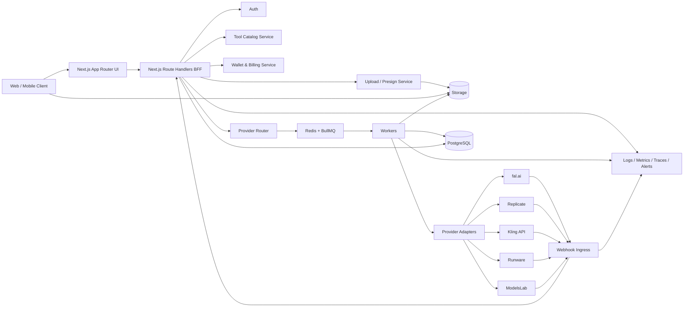
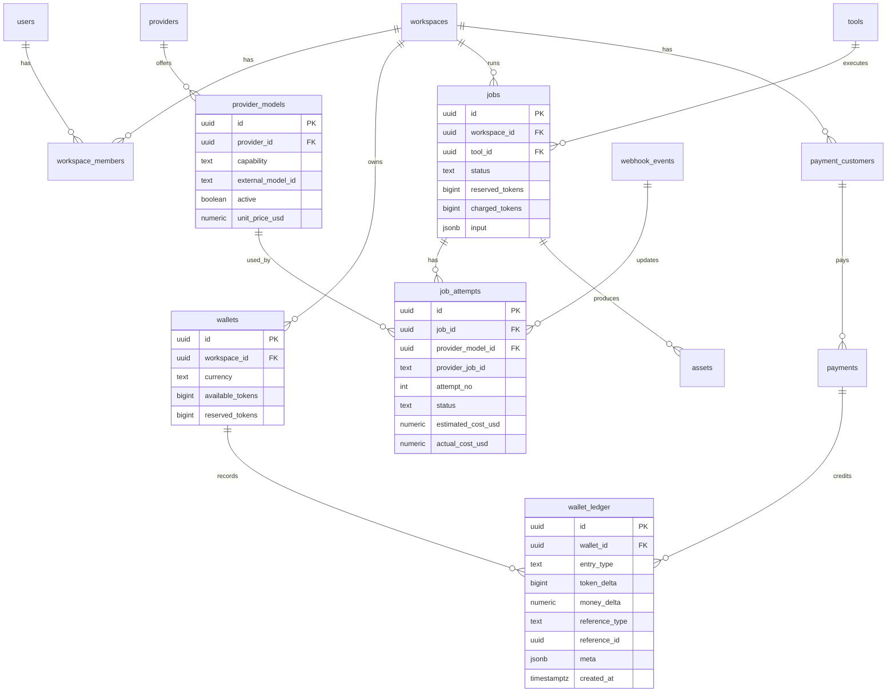
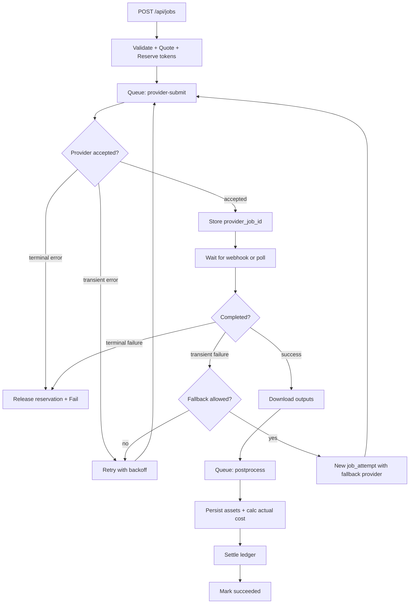

# Архитектура и план реализации AI Creative Hub

> Глубокое research-исследование архитектуры, провайдерской стратегии, экономики
> и плана реализации. Загружено в проект 2026-05-19. Используется как канонический
> reference для архитектурных решений.

## Executive summary

Для SaaS-агрегатора нейросетей оптимальная стратегия — **не строить «всё своё» на
уровне моделей**, а строить **собственный control plane**: единый каталог
инструментов, token wallet, биллинг, job orchestration, storage, аналитика,
rate limits, provider router, fallback и UX. Сами генерации нужно подключать
через адаптеры к внешним AI-провайдерам.

На практике самый сильный стартовый вариант — **гибридная модель**:
**прямые интеграции** для ключевых функций и маржинальных сценариев, плюс
**один агрегатор как ускоритель каталога и fallback-слой**. Это связано с тем,
что fal.ai, Replicate и Kling дают официальные API, очереди, webhooks и
предсказуемые модели биллинга, а Runware и ModelsLab уже сами выступают
как unified API/aggregator для множества моделей.

**Ядро MVP:**
- **Next.js + TypeScript** как BFF и dashboard
- **Postgres** (Supabase или self-host) как system of record
- **Redis + BullMQ** для очередей
- **MinIO / S3 / Supabase Storage** для медиа
- **Stripe или Paddle** для пополнения кошелька
- AI-функции — через **fal.ai / Replicate / Kling direct**
- **Runware или ModelsLab** — как слой быстрого расширения каталога

**Главный архитектурный вывод:** wallet должен быть **ledger-first**,
а не «balance field with increments». Каждая операция — reserve, settle, refund,
bonus, admin adjustment, payment credit — должна попадать в неизменяемый ledger.
Это резко упрощает reconciliation, chargeback handling, споры по фактической
стоимости и подключение подписок / кредитных грантов.

С точки зрения экономики, основная статья расходов — **не инфраструктура,
а model API spend**. Pricing engine и provider router — не nice-to-have,
а экономическое ядро продукта.

---

## Рекомендуемая архитектура

### Что строить самому и что брать с рынка

| Слой | Рекомендация | Почему |
|---|---|---|
| UI, кабинет, каталог, pricing UI, история задач | **Своё** | Это ваш продукт, retention и upsell-слой |
| Token wallet, ledger, reservation/settlement, internal billing | **Своё** | Главный бизнес-актив и дифференциатор |
| Job orchestration, retries, fallback, analytics | **Своё** | Без этого нет контроля SLA, COGS и UX |
| Model execution | **Внешние провайдеры через адаптеры** | Экономия месяцев разработки и GPU-операций |
| Быстрое расширение каталога | **Runware или ModelsLab как unified API** | Быстрее добавлять модели и capability groups |
| Ключевые «hero tools» | **Прямые интеграции** | Лучше контроль цены, latency, feature surface, маржи |

Runware прямо описывает свой API как **single endpoint**, абстрагирующий модели
и провайдеров за единым интерфейсом. ModelsLab позиционирует себя как платформу
с **10,000+ models** и единым API/SDK. fal.ai и Replicate дают сильные primitives:
webhooks, queue/polling, predictable pricing и model-level APIs.

### Рекомендуемый провайдерский контур для MVP

| Провайдер | Что брать первым | Почему именно вам |
|---|---|---|
| **fal.ai** | Nano Banana, image edit, upscale, video/edit models | Durable queue, webhook delivery, pricing API, output-based pricing |
| **Replicate** | Nano Banana 2, official models, часть video/edit | Predictable pricing, webhook events, timeout/deadline, model fallback |
| **Kling direct** | Главный video stack | Собственный API, callback model, external task IDs, credits-per-second |
| **Runware** | Быстрый каталог, upscale, background removal, secondary routes | Unified API, `includeCost`, async/webhook patterns, реальные model cards с ценами |
| **ModelsLab** | Long-tail каталог и временный fallback | Может быстро закрыть пробелы, но billing/compliance/latency валидировать |

**Выбор для первого релиза:** fal.ai + Kling direct + Replicate, а **Runware** —
как ускоритель каталога и fallback. **ModelsLab** подключаем только после
проверки качества/latency/юридики на своих сценариях.

### Целевая схема платформы



### Базовые архитектурные принципы

**Async-first.** Всё, что может длиться больше 2-3 секунд, уходит в job queue.
Это совпадает с тем, как fal.ai, Runware, Replicate и ModelsLab проектируют
long-running workloads.

**Ledger-first billing.** Пользовательский баланс — это производная от журнала
операций, а не главный источник истины. Best practice для wallet logic и
reconciliation.

**Provider-neutral tool catalog.** Пользователь выбирает «Face Swap» или
«Upscale», а не «Replicate model X». Конкретный provider/model выбирает
router по policy.

**Cost-aware routing.** Стоимость и маржа должны вычисляться **до submit** и
**перепроверяться после completion** по фактическому vendor usage. У fal.ai есть
pricing API, Runware возвращает exact `cost`, Replicate даёт predictable pricing,
Kling — credit math.

**Private-by-default media.** Все uploads и outputs — приватные. Выдача наружу
только через presigned URLs с коротким TTL и явными sharing flags.

---

## Данные, wallet и биллинг

### Как должен работать token wallet

Введите **две независимые плоскости учёта**:

- **Денежная плоскость** — сколько денег пользователь внёс через Stripe / Paddle / CloudPayments
- **Токенная плоскость** — сколько внутренних credits/tokens он получил, зарезервировал, потратил, вернул или получил бонусом

**Не смешивайте** vendor cost в USD и пользовательские tokens в одной таблице.
Нужен явный conversion layer: `token_price_table`, `fx_snapshot`,
`provider_cost_snapshot`, `margin_policy`. Это позволит менять retail pricing
без поломки исторических расчётов.

**Биллинг-процесс:**

```
top-up → ledger credit → quote → reserve tokens → submit job
       → job success/fail → settle actual cost → release delta / charge delta
```

### Рекомендуемая ER-схема



### Ключевые индексы

| Сущность | Критичные индексы | Зачем |
|---|---|---|
| `wallets` | `UNIQUE(workspace_id)` | 1 wallet на workspace |
| `wallet_ledger` | `INDEX(wallet_id, created_at DESC)`, `UNIQUE(reference_type, reference_id, entry_type)` | История, anti-duplicate |
| `jobs` | `INDEX(workspace_id, created_at DESC)`, partial `WHERE status IN ('queued','processing')` | Dashboard + work queue views |
| `job_attempts` | `UNIQUE(provider_job_id)`, `INDEX(job_id, attempt_no)` | Retry/fallback lineage |
| `provider_models` | `UNIQUE(provider_id, external_model_id)` | Роутинг |
| `payments` | `UNIQUE(processor, processor_payment_id)` | Reconciliation |
| `webhook_events` | `UNIQUE(provider, event_id)` | Webhook dedup |

Partial indexes полезны там, где много исторических записей и небольшой
«горячий» срез активных jobs.

### Формула расчёта токенов, себестоимости и маржи

**Не делайте «1 provider dollar = N tokens» в лоб.** Нужна формула с учётом
платёжного слюза, инфраструктуры, retries и операционного резерва.

```text
effective_payment_fee_rate =
  (processor_percent_fee * avg_topup_amount + fixed_fee) / avg_topup_amount

landed_cost_usd =
  provider_cost_usd
  * retry_factor
  * provider_fx_buffer
  * infra_overhead_factor

target_sell_cost_usd =
  landed_cost_usd
  * (1 + effective_payment_fee_rate)
  * (1 + support_risk_reserve)
  * (1 + target_gross_margin)

tokens_to_charge =
  ceil(target_sell_cost_usd / token_usd_value)
```

Если Stripe (US, **2.9% + $0.30**) и средний топ-ап $25:

- `token_usd_value = $0.01`
- `avg_topup_amount = $25`
- Stripe fee ≈ `(0.029 * 25 + 0.30) / 25 = 4.1%`
- `retry_factor = 1.05`
- `infra_overhead_factor = 1.08`
- `support_risk_reserve = 0.07`
- `target_gross_margin = 0.25`

→ multiplier ≈ `1.05 * 1.08 * 1.041 * 1.07 * 1.25 ≈ 1.52`

### Примеры токенизации

| Функция | Raw cost | Sell с multiplier 1.52 | Charge |
|---|---:|---:|---:|
| Replicate Nano Banana 2 1K | $0.067 | $0.102 | **11 tokens** |
| fal Nano Banana 2 | $0.08 | $0.122 | **13 tokens** |
| Runware P-Image Upscale 1-4MP | $0.005 | $0.0076 | **1 token** |
| Kling 720p 5s без аудио | ~$0.42 | ~$0.64 | **64 tokens** |

Kling 720p no-audio = 6 credits/s, prepaid pack = $0.084/s → 5s = $0.42.

### Деньги против токенов

**Не делайте Stripe Billing meters источником истины** для AI wallet. Stripe
meters хороши как **внешний invoice/subscription layer**, но не замена
real-time wallet. Причина: вам нужна мгновенная проверка баланса на submit,
резервирование, release, бонусные кредиты, promo grants, manual corrections и
cross-provider settlement.

---

## API, очереди и ProviderAdapter

### Внутренний API-контракт

Стройте API вокруг **tool-first** и **job-first** модели, а не вокруг конкретных
вендоров.

| Метод | Endpoint | Назначение |
|---|---|---|
| `GET` | `/api/tools` | Каталог доступных инструментов и их схемы |
| `GET` | `/api/tools/{slug}` | Детали инструмента, pricing hints, input schema |
| `POST` | `/api/uploads/presign` | Presigned upload URL |
| `POST` | `/api/wallet/quote` | Предварительная оценка цены в токенах |
| `GET` | `/api/wallet` | Текущий баланс, reserved, pending settlements |
| `POST` | `/api/wallet/topups` | Создание hosted checkout / payment session |
| `POST` | `/api/jobs` | Создание job |
| `GET` | `/api/jobs/{id}` | Статус, outputs, usage, cost |
| `GET` | `/api/jobs` | История jobs с фильтрами |
| `POST` | `/api/jobs/{id}/cancel` | Отмена если провайдер поддерживает |
| `POST` | `/api/webhooks/{provider}` | Приём provider webhooks |
| `GET` | `/api/admin/providers` | Health/latency/cost dashboard |
| `POST` | `/api/admin/provider-models/sync` | Обновление router catalog/prices |

### Пример создания job

```http
POST /api/jobs
Authorization: Bearer <session>
Content-Type: application/json

{
  "toolSlug": "image-edit-nanobanana",
  "input": {
    "prompt": "Replace the background with a minimal white studio setup",
    "imageUrls": ["https://storage.example.com/private/in/abc123.png"],
    "outputResolution": "1k"
  },
  "routingHints": {
    "providerPreference": ["fal", "replicate"],
    "maxCostUsd": 0.12,
    "priority": "normal"
  },
  "clientRequestId": "0a5da4ab-9b2f-4c78-9a44-1ef1cbe84e5f"
}
```

Ответ:

```json
{
  "jobId": "job_01JXXYZ7N4Q7D2M6WZ4W7V8QH1",
  "status": "queued",
  "estimatedTokens": 13,
  "walletReservation": {
    "reservationId": "wres_01JXXYZ8E4D9VW2C2M7T6Y8Q3B",
    "reservedTokens": 13
  },
  "routerDecision": {
    "selectedProvider": "fal",
    "selectedModel": "fal-ai/nano-banana-2",
    "fallbackProviders": ["replicate"]
  }
}
```

### Жизненный цикл job

```
draft → quoted → reserved → queued → submitted → processing
      → postprocessing → succeeded | failed | canceled
```

Внутри `job_attempts` отдельные состояния по провайдерам:
- **fal**: `IN_QUEUE / IN_PROGRESS / COMPLETED`, webhook `status=OK/ERROR`
- **Replicate**: prediction lifecycle с terminal events и webhooks
- **Runware**: async tasks, `processing/success/error`
- **Kling**: task creation + query by `task_id` / `external_task_id` + callback URL
- **ModelsLab**: async `fetch_result`, `webhook`, `track_id`

### Очереди, retries и fallback



**BullMQ** официально поддерживает retries с backoff и deduplication по
identifier. Различайте transient (5xx, 429, network) и terminal (4xx, validation,
moderation) errors.

### Рекомендуемые очереди

| Очередь | Payload | Назначение |
|---|---|---|
| `job-submit` | `jobId, attemptNo` | Отправка на провайдера |
| `job-poll` | `jobAttemptId` | Polling где нет webhook |
| `job-webhook-dispatch` | raw event | Быстрый приём вебхуков и отложенная обработка |
| `job-postprocess` | `jobId` | Копирование output в storage, thumbnail, metadata |
| `ledger-settle` | `jobId` | Сведение estimate vs actual |
| `provider-health` | provider code | Поддержание score router'а |
| `cleanup-expired` | bucket/key refs | TTL cleanup |
| `audit-export` | date range | Periodic financial / compliance export |

### TypeScript интерфейс ProviderAdapter

```ts
export type ToolCapability =
  | "image.generate" | "image.edit" | "image.upscale" | "image.remove_bg"
  | "video.generate" | "video.edit" | "face.swap";

export type JobState =
  | "queued" | "processing" | "succeeded" | "failed" | "canceled";

export interface ToolInvocation {
  capability: ToolCapability;
  toolSlug: string;
  input: Record<string, unknown>;
}

export interface ProviderQuote {
  provider: string;
  model: string;
  estimatedCostUsd: number;
  estimatedLatencySec?: number;
  canRun: boolean;
  reasons?: string[];
}

export interface SubmitContext {
  jobId: string;
  attemptNo: number;
  idempotencyKey: string;
  webhookUrl: string;
  timeoutMs?: number;
}

export interface ProviderSubmitResult {
  provider: string;
  model: string;
  externalJobId: string;
  state: "queued" | "processing";
  estimatedCostUsd?: number;
  raw: unknown;
}

export interface ProviderStatus {
  provider: string;
  externalJobId: string;
  state: JobState;
  outputs?: Array<{
    url: string;
    mimeType?: string;
    width?: number;
    height?: number;
    durationSec?: number;
  }>;
  actualCostUsd?: number;
  errorCode?: string;
  errorMessage?: string;
  raw: unknown;
}

export interface ProviderAdapter {
  readonly provider: string;
  supports(invocation: ToolInvocation): boolean;
  quote(invocation: ToolInvocation): Promise<ProviderQuote>;
  submit(invocation: ToolInvocation, ctx: SubmitContext): Promise<ProviderSubmitResult>;
  poll(externalJobId: string): Promise<ProviderStatus>;
  cancel(externalJobId: string): Promise<void>;
  verifyWebhook?(headers: Headers, rawBody: string): Promise<boolean>;
  parseWebhook?(headers: Headers, rawBody: string): Promise<ProviderStatus>;
}
```

Интерфейс специально разделяет `quote / submit / poll / parseWebhook / cancel`,
потому что у провайдеров очень разная асинхронная модель.

> **Замечание:** наш текущий интерфейс в [src/lib/providers/types.ts](../src/lib/providers/types.ts)
> использует `submit / getStatus / parseWebhook / cancel` без `quote`.
> Расширение с `quote()` методом — backlog для Stage 2, нужно для cost-aware
> routing и более точного эстимейта токенов до резерва.

### Router policy

```text
route_score =
  capability_match
  * provider_health_score
  * policy_weight
  * margin_score
  * latency_score
  * success_rate_score
```

Practical flow:
1. Отфильтровать провайдеров по capability
2. Отфильтровать по policy: allowed regions, NSFW, commercial use, maxCostUsd, SLA tier
3. Для каждого кандидата взять quote / cached price
4. Выбрать primary
5. Сохранить fallback chain
6. После каждого завершения пересчитать provider health и cost drift

---

## Безопасность, compliance и эксплуатация

### Security baseline

| Требование | Что сделать |
|---|---|
| Provider secrets | Никогда не отдавать ключи в браузер; только server-side adapters |
| Auth & multi-tenancy | Workspace-scoped access + RLS на Postgres |
| Storage | Private buckets by default, presigned URLs с коротким TTL |
| Webhooks | Signature verification + raw body preservation + dedup table |
| Billing | Idempotency keys на все POST write-операции |
| Wallet | Transactional reserve/settle + audit trail |
| Abuse control | Per-user / per-workspace rate limits + max concurrent jobs |
| Content safety | Moderation rules и allowed-use policy для face-swap/deepfake |
| Admin actions | Immutable audit log для price changes, refunds, credits, routing overrides |

### Webhook hardening

1. **Проверять подпись** где провайдер её даёт
2. **Отвечать быстро 2xx**, а тяжёлую работу сводить в очередь
3. **Дедуплицировать event IDs / request IDs**

### Payment provider map

| Сценарий | Лучший выбор | Почему |
|---|---|---|
| Глобальный SaaS с налоговой сложностью | **Paddle** | Merchant of record, taxes, subscriptions, 30 currencies / 200+ markets |
| Гибкий кастомный billing stack | **Stripe** | Checkout, subscriptions, one-time, usage-based, idempotency |
| Региональный acquiring / recurring (РФ) | **CloudPayments / ЮKassa / Telegram Stars** | Token-based recurring, Basic Auth API |

### GDPR и правовые риски

- **Face-swap / voice clone / avatar** = биометрические данные → GDPR Article 9
- **EU AI Act Article 50** — transparency obligations для generative AI и deepfakes, применяется **с 2 августа 2026**
- Provider-level требования: Kling требует disclosure в privacy policy вашего приложения
- DPA, SCC, vendor list, retention schedule, региональная политика маршрутизации данных
- FTC отдельно отмечает risks fraud/extortion для voice cloning — нужен consent + abuse reporting + takedown policy

### Observability

- **Sentry** для exception tracking, traces, release health
- **OpenTelemetry** как vendor-neutral tracing layer (Next.js поддерживает out of the box)
- **Structured JSON logs** с `jobId, workspaceId, provider, providerJobId, attemptNo, ledgerRef, requestId`
- **Provider SLO dashboards**: success rate, p50/p95 latency, webhook delay, retry rate, cost drift
- **Billing alerts**: wallet negative delta, unmatched payment, unmatched webhook, estimated vs actual > threshold
- **Fraud/abuse alerts**: burst submit, repeated failed top-ups, anomalous token burn, repeated face-swap by same account

### CI/CD и окружения

Три окружения: `dev`, `staging`, `prod`. Feature flags на новых провайдеров/моделей.

### Environment variables (минимальный набор)

| Категория | Переменные |
|---|---|
| App | `NODE_ENV`, `APP_URL`, `DASHBOARD_URL`, `API_BASE_URL` |
| Postgres | `DATABASE_URL`, `DIRECT_URL` |
| Redis / BullMQ | `REDIS_URL`, `BULLMQ_PREFIX`, `BULLMQ_CONCURRENCY_DEFAULT` |
| Storage | `S3_ENDPOINT`, `S3_REGION`, `S3_BUCKET_PRIVATE`, `S3_BUCKET_PUBLIC`, `S3_ACCESS_KEY_ID`, `S3_SECRET_ACCESS_KEY` |
| Wallet / pricing | `TOKEN_USD_VALUE`, `DEFAULT_MARGIN`, `DEFAULT_RETRY_FACTOR`, `DEFAULT_INFRA_FACTOR` |
| Stripe | `STRIPE_SECRET_KEY`, `STRIPE_WEBHOOK_SECRET`, `STRIPE_PRICE_TOPUP_*` |
| Paddle | `PADDLE_API_KEY`, `PADDLE_WEBHOOK_SECRET`, `PADDLE_ENVIRONMENT` |
| CloudPayments | `CLOUDPAYMENTS_PUBLIC_ID`, `CLOUDPAYMENTS_API_SECRET` |
| fal.ai | `FAL_KEY`, `FAL_WEBHOOK_SIGNING_SECRET` |
| Replicate | `REPLICATE_API_TOKEN` |
| Kling | `KLING_API_KEY`, `KLING_BASE_URL` |
| Runware | `RUNWARE_API_KEY`, `RUNWARE_WEBHOOK_TOKEN` |
| ModelsLab | `MODELSLAB_API_KEY` |
| Monitoring | `SENTRY_DSN`, `OTEL_EXPORTER_OTLP_ENDPOINT`, `OTEL_SERVICE_NAME` |
| Email / ops | `RESEND_API_KEY`, `OPS_ALERT_EMAIL`, `SLACK_WEBHOOK_URL` |

---

## План реализации и MVP

### MVP-состав

**P0**
- Auth + workspace model
- Wallet + prepaid top-up
- Tool catalog
- Submit job / job history
- Upload / storage
- Queue + webhook ingestion
- 4 инструмента: Nano Banana generate/edit, Kling video generate, Upscale, Background removal / face-swap
- Admin pricing + provider health
- Basic analytics

**P1**
- Multiple fallbacks per tool
- Promo codes / bonus credits
- Team workspace invites
- Usage limits / quotas
- B2B invoices
- Audio/lip-sync/avatar tools

**P2**
- Workflow chaining
- Custom presets / saved prompts
- Auto-routing by intent
- Marketplace/sub-app model
- White-label / API access for third parties

### Поэтапный план с оценкой

| Этап | Что входит | Приоритет | Оценка |
|---|---|---:|---:|
| Foundation | Repo, monorepo, env, schema, auth, RLS, UI shell | P0 | 20-30ч |
| Wallet core | Ledger schema, reserve/settle logic, quote service, admin corrections | P0 | 24-36ч |
| Payments | Stripe/Paddle, top-up packs, webhook reconciliation | P0 | 20-32ч |
| Storage pipeline | Presigned uploads, private buckets, asset persistence, cleanup jobs | P0 | 12-20ч |
| Queue orchestration | Redis/BullMQ, worker runner, webhook ingress, retries/backoff/dedup | P0 | 24-36ч |
| Provider router | Catalog, model mapping, route policy, health scoring | P0 | 18-28ч |
| fal adapter | Submit/poll/webhook | P0 | 12-18ч |
| Replicate adapter | Submit/poll/webhook | P0 | 12-18ч |
| Kling adapter | Submit/poll/callback | P0 | 16-24ч |
| Tool UX | Tools pages, forms, progress UI, history, outputs viewer | P0 | 24-40ч |
| Admin & pricing | Tool config, price tables, margin policy, usage dashboard | P1 | 16-28ч |
| Monitoring | Sentry, OTel, dashboards, alerting | P0 | 12-18ч |
| Security hardening | Webhook verification, idempotency, audit log, abuse limits | P0 | 16-24ч |
| QA & go-live | Integration tests, staging, smoke tests, runbooks | P0 | 20-32ч |

Для **одного сильного full-stack разработчика** это ≈ **246-384 часа**, то есть
**6-10 недель** до уверенного MVP плюс **2-4 недели** до спокойного продакшна
с monitoring, reconciliation и admin tooling.

### Рекомендуемый порядок интеграций

**Спринт 1**
- auth, wallet ledger, Stripe top-ups, upload/storage, fal Nano Banana, job history

**Спринт 2**
- Kling video, BullMQ retries/fallback, provider admin, metrics + Sentry + OTel

**Спринт 3**
- Replicate fallback, background removal/upscale, pricing policies, QA + launch checklist

### Тест-план

| Слой | Что тестировать | Критерий |
|---|---|---|
| Unit | pricing engine, token conversion, router scoring, webhook verification | deterministic results |
| DB | ledger consistency, reservation/settlement invariants, RLS policies | no negative balance races, no cross-tenant access |
| Integration | payment webhooks, provider submit/poll/webhook, storage pipeline | idempotent, replay-safe |
| E2E | user signup → top-up → upload → run tool → receive output | happy path under staging |
| Chaos / failure | 429/503 from providers, duplicate webhooks, lost webhook, worker restart | graceful retry or fail-safe release |
| Security | auth bypass, cross-workspace access, unsigned webhook, forged clientRequestId | blocked |
| Financial | refund, chargeback-like admin reversal, partial settle, retry settle | ledger stays balanced |
| Load | bursts on POST /jobs, webhook floods, polling spikes | no queue collapse |

### Критерии готовности MVP

- Юзер может зарегистрироваться, пополнить wallet и получить tokens
- Минимум **4 инструмента** работают end-to-end
- Каждое списание проходит через reserve → settle flow
- Job history показывает input/output/status/provider/cost
- Есть хотя бы один fallback path для двух самых дорогих инструментов
- Все payment и provider webhooks идемпотентны
- Есть dashboard по success/failure/cost per provider
- Есть basic abuse controls и legal pages
- Staging проходит полный smoke path после каждого preview/release

---

## Бюджет и открытые вопросы

### Базовые рыночные цены (подтверждено model cards)

| Компонент | Ориентир |
|---|---:|
| Replicate Nano Banana 2 1K | **$0.067 / image** |
| fal Nano Banana 2 | **$0.08 / image** |
| Runware Nano Banana Pro | **от $0.138 / image** |
| Runware P-Image Upscale 1-4MP | **$0.005 / image** |
| fal Topaz Upscale up to 24MP | **$0.08 / image** |
| Kling VIDEO 3.0 direct 720p no-audio | **6 credits/s** = **$0.084 / 1s** |
| Runware Kling VIDEO 3.0 Standard | **$0.084 / 1s 720p no-audio**, **$0.126 / 1s 720p audio** |
| Stripe standard cards (US) | **2.9% + $0.30** |
| Vercel Pro | **$20/month** baseline |
| Upstash Redis | pay-per-request, start free |
| AWS S3 Standard | **$0.023 per GB-month** for first 50TB |

### Пример месячного API-бюджета

Realistic mix:
- 20,000 image jobs × $0.067 = **$1,340**
- 5,000 cheap upscale × $0.005 = **$25**
- 2,000 видео × 5s no-audio × $0.084/s = **$840**
- 500 видео × 5s audio × $0.126/s = **$315**
- 500 premium upscale × $0.08 = **$40**

**Raw model spend ≈ $2,560 / месяц**. С учётом retries / drift / premium routing
закладывайте **$2,800-3,300/месяц только на AI API**.

### Шестимесячный operational budget

| Категория | Lean launch | Realistic launch |
|---|---:|---:|
| AI API spend | $5k-12k / 6мес | $15k-30k / 6мес |
| Vercel | $120-300 | $240-600 |
| Redis / queue infra | $0-150 | $150-600 |
| Object storage + CDN/egress | $100-400 | $400-1,500 |
| Monitoring / error tracking | $0-300 | $300-1,200 |
| Managed DB/backend reserve | $300-900 | $900-2,400 |
| Misc ops | $100-500 | $400-1,500 |
| **Итого** | **≈ $5.6k-14.5k** | **≈ $17.4k-37.8k** |

> Главный вывод: **infra rarely kills margin; bad routing kills margin**.
> На раннем этапе главное — не «сэкономить на Vercel», а не отправлять дорогие
> user flows на невыгодные провайдеры без надобности.

### Финальная рекомендация

| | |
|---|---|
| Frontend/BFF | Next.js + TypeScript |
| DB/Auth | Postgres (Supabase или self-host) |
| Queue | Redis + BullMQ |
| Storage | Supabase Storage на старте; S3/MinIO при росте |
| Billing | Stripe first; Paddle если MoR / tax-first GTM |
| Hero providers | fal.ai + Kling direct + Replicate |
| Expansion layer | Runware |
| Wallet | Internal immutable ledger |
| Observability | Sentry + OTel |
| Pricing | Token-led, не raw pass-through |
| Launch philosophy | 4-6 tools max в MVP, но с качественным wallet/retries/fallback |

### Открытые вопросы и ограничения

- **«Магнит»** в feature list не является стандартизированным capability name —
  перед реализацией уточнить: motion magnetism, prompt magnet, attention tool,
  video retargeting или что-то кастомное
- **Точные Kling REST paths** зависят от capability page — хранить в config
  `provider_models`, не хардкодить
- **Юридическая модель deepfake/face-swap** зависит от рынков, TOS, consent
  model и того, будете ли поддерживать voice/avatar features с impersonation risk
- **ModelsLab и часть aggregator-провайдеров** перед production usage прогнать
  через собственный scorecard: p95 latency, stability, webhook reliability,
  commercial terms, DPA posture, hidden vendor dependencies

---

## Mapping research → текущая реализация

| Recommendation | Статус в ai-hub | Где |
|---|---|---|
| Next.js + TS + BFF Route Handlers | ✅ | App Router, все API в `src/app/api/` |
| Postgres + Drizzle ORM | ✅ | self-host в `aisales-postgres`, БД `ai_hub` |
| Redis + BullMQ | ✅ | `src/lib/jobs/queue.ts` + worker process |
| MinIO storage | ✅ | `src/lib/storage/index.ts` (S3 SDK) |
| Stripe Checkout + webhook | ✅ | `src/app/api/checkout/` + `webhooks/stripe/` |
| fal.ai adapter (HMAC webhook) | ✅ | `src/lib/providers/adapters/fal.ts` |
| Replicate adapter (Standard Webhooks) | ✅ | `src/lib/providers/adapters/replicate.ts` |
| Kling direct adapter | ❌ Stub | Сейчас идём через fal.ai (Kling 1.6 + 2.1 Master) |
| Runware adapter | ❌ Stub | Backlog Stage 2 |
| ModelsLab adapter | ❌ Stub | Backlog Stage 2 |
| Ledger-first wallet | 🟡 | Есть `token_transactions` ledger, но нет двух плоскостей (money vs tokens) — один тип `currency` |
| Atomic reserve/charge/refund (race-free) | ✅ | 4 SECURITY DEFINER функции в SQL |
| Quote API (`/api/wallet/quote`) | ❌ | Backlog · сейчас цена в `tool.token_cost` хардкод, нет dynamic quote |
| Cost-aware routing с health score | ❌ | Stage 2 — сейчас static router-map provider → adapter |
| Provider fallback chain | ❌ | Stage 2 |
| `job_attempts` (история попыток с разными провайдерами) | ❌ | Сейчас одна попытка на job, ретраев нет |
| Idempotency keys на webhook | ✅ | Через `job.status` check |
| Webhook signature verification | ✅ | HMAC (fal) + Standard Webhooks (Replicate) |
| Rate limit per user | ✅ | 5 concurrent jobs |
| Structured JSON logger | ✅ | `src/lib/logger.ts` |
| Sentry / OTel | ❌ | Stage 2 backlog |
| RLS | ⚠️ | Self-host paradigm — проверки в Drizzle queries по userId, RLS не включена |
| Welcome bonus | ✅ | 100 токенов на SQL-триггере |
| Admin panel (CRUD tools, refund, grant) | ✅ | 6 табов (включая Transactions) |

### Главные gaps от research → roadmap stage 2

1. **Quote API** — динамическая оценка цены до резерва. Сейчас цена статична в
   `ai_tools.token_cost`. Под cost-aware routing нужна функция
   `quote(toolSlug, input) → estimatedCostUsd → tokens`.

2. **`job_attempts` таблица** — отдельная сущность для попыток. Сейчас retry
   живёт в BullMQ, в БД одна запись `ai_jobs`. Для fallback chains и cost
   tracking по провайдеру нужна отдельная таблица.

3. **Provider health scoring + fallback chains** — Stage 2. Сейчас провайдер
   жёстко привязан к tool (`tool.provider`). Под fallback нужен router scoring и
   попытки на разных провайдерах.

4. **Two-plane wallet (money + tokens)** — сейчас одна плоскость (tokens).
   Под margin policy и FX tracking нужна разделённая модель: `payments`
   (деньги) → `token_packages` (конверсия) → `token_transactions` (только токены).

5. **Sentry + OTel** — Stage 2 observability.

6. **GDPR + AI Act compliance** — privacy policy, consent flow для face-swap,
   DPA inventory. Применимо с 2026-08-02 (EU AI Act Article 50).

7. **Provider P&L analytics** — `provider_cost_usd` поле есть в `ai_jobs`, но
   агрегации по margin / drift нет.
